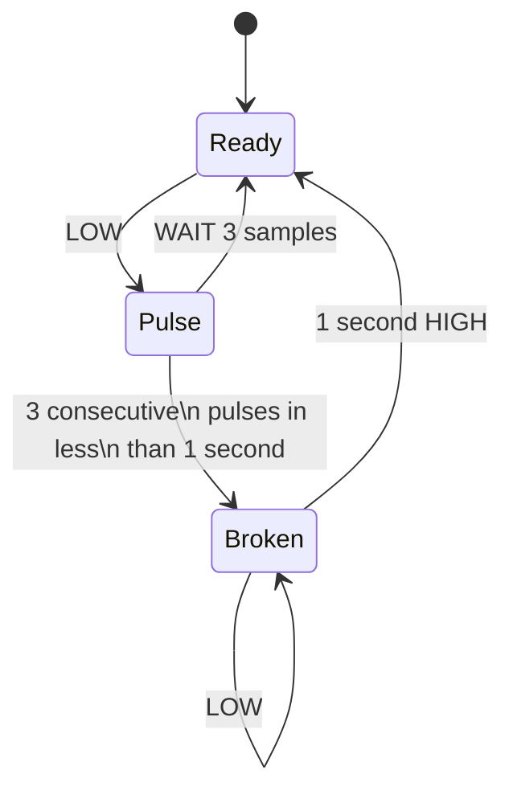

# aeon_feeder_fix

This IR beam break processing code is a temporary workaround to filter the adaptive threshold signal in the case where the chute is blocked by accidental delivery of multiple pellets. The following state machine describes the filtering operation:

The code runs on top of [MicroPython](https://github.com/micropython/micropython), an implementation of a Python interpreter for microcontrollers.

## How to install

### Prerequisites

* [Raspberry Pi Pico SDK](https://www.raspberrypi.com/news/raspberry-pi-pico-windows-installer/)
* [Thonny IDE](https://thonny.org/)

### Firmware

Before running the actual Python code, we need to install the MicroPython firmware in the Pico. To do this, boot the Pico into firmware update mode by holding the BOOTSEL button while plugging the USB cable into the computer, then release. A storage drive should now be mounted on the computer, e.g. RPI-RP2.

To install the firmware, drag the MicroPython release file for the Pi Pico, e.g. [`RPI_PICO-20231005-v1.21.0.uf2`](https://micropython.org/resources/firmware/RPI_PICO-20231005-v1.21.0.uf2) into the storage drive. The drive should be automatically unmounted and the Pico will then boot straight into MicroPython.

### MicroPython code

The IR beam break processing code is implemented in the `main.py` file. This should be transferred to the root of the pico file system so it can be executed on reset. The [Thonny IDE](https://thonny.org/) provides a simple way to inspect, test and manipulate MicroPython code stored in the Pico.